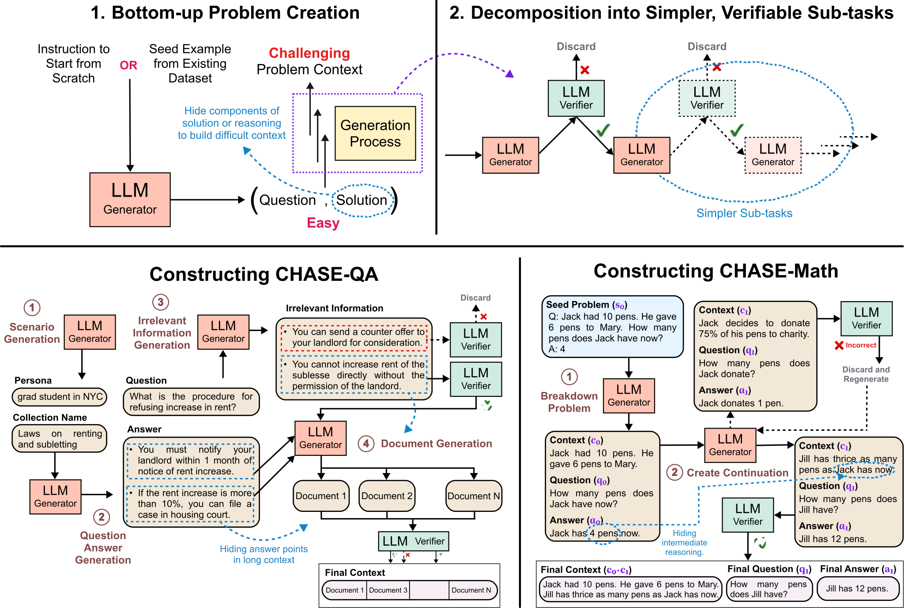

<h2 align="center">
  CHASE: Challenging AI with Synthetic Evaluations
</h2>
<!-- <h5 align="center">Evaluating the In-Context Learning Ability of Large Language Models to Generalize to Novel Interpretations</h5> -->

<p align="center">
  <a href="https://arxiv.org/pdf/2502.14678"></a>
  <a href="https://github.com/McGill-NLP/incontext-code-generation/blob/main/LICENSE">
    
  </a>
</p>

<p style="text-align: justify;">
The pace of evolution of Large Language Models (LLMs) necessitates new approaches for rigorous and comprehensive evaluation. Traditional human annotation is increasingly impracticable due to the complexities and costs involved in generating high-quality, challenging problems. In this work, we introduce **CHASE**, a unified framework to synthetically generate challenging problems using LLMs without human involvement.  For a given task, our approach builds a hard problem in a bottom-up manner from simpler components. Moreover, our framework decomposes the generation process into independently verifiable sub-tasks, thereby ensuring a high level of quality and correctness. We implement CHASE to create evaluation benchmarks across three diverse domains: (1) document-based question answering, (2) repository-level code completion, and (3) math reasoning. The performance of state-of-the-art LLMs on these synthetic benchmarks lies in the range of 40-60% accuracy, thereby demonstrating the effectiveness of our framework at generating challenging problems.
</p>
<h2 align="center">
  
</h2>


# Setup

Install VirtualEnv using the following (optional):

```shell
$ [sudo] pip install virtualenv
```

Create and activate your virtual environment (optional):

```shell
$ virtualenv -p python3 chasenv
$ source chasenv/bin/activate
```

Depending on your machine, you may have to do:

```shell
$ python3 -m venv chasenv
$ source chasenv/bin/activate
```

## Dependencies

- compatible with python 3
- dependencies can be installed using `CHASE/requirements.txt`
- Works best with CUDA 12.5 (otherwise you may have to struggle with installation of individual libraries)

Install all the required packages:

at `CHASE/:`

```shell
$ pip install -r requirements.txt
```

# Usage

1. [Instructions for CHASE-QA](https://github.com/McGill-NLP/CHASE/blob/main/qa/README.md)
2. [Instructions for CHASE-Code](https://github.com/McGill-NLP/CHASE/blob/main/code/README.md)
3. [Instructions for CHASE-Math](https://github.com/McGill-NLP/CHASE/blob/main/math/README.md)

# Citation

If you use our data or code, please cite our work:

```
@misc{patel2025llmgeneratechallengingproblems,
      title={How to Get Your LLM to Generate Challenging Problems for Evaluation}, 
      author={Arkil Patel and Siva Reddy and Dzmitry Bahdanau},
      year={2025},
      eprint={2502.14678},
      archivePrefix={arXiv},
      primaryClass={cs.CL},
      url={https://arxiv.org/abs/2502.14678}, 
}
```

For any clarification, comments, or suggestions please contact [Arkil](http://arkilpatel.github.io/).
